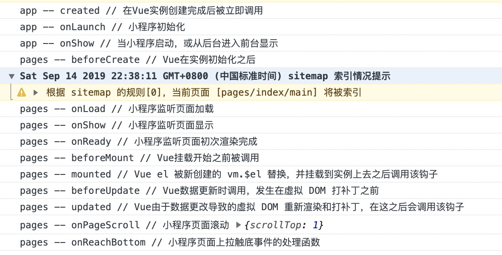

* content
{:toc}

## 介绍
> mpVue是“基于Vue”的框架。而这个mpvue是从整个Vue的核心代码上经过二次开发而形成的一个框架，相当于是给Vue本身赋能，增加了开发微信小程序的能力。  
>  
> mpvue 保留了 vue.runtime 核心方法，无缝继承了 Vue.js 的基础能力  
>  
> mpvue-template-compiler 提供了将 vue 的模板语法转换到小程序的 wxml 语法的能力  
>  
> 可以直接构建出符合小程序项目结构的代码格式： json/wxml/wxss/js 文件

## 生命周期
> 同时包含了[vue的生命周期](https://cn.vuejs.org/v2/api/#%E9%80%89%E9%A1%B9-%E7%94%9F%E5%91%BD%E5%91%A8%E6%9C%9F%E9%92%A9%E5%AD%90)和[小程序的生命周期](https://developers.weixin.qq.com/miniprogram/dev/framework/app-service/app.html)  
>  
> 在小程序 onReady 后，再去触发 vue mounted 生命周期  
>  
> 除特殊情况外，不建议使用小程序的生命周期钩子。  

  
  


## 创建项目
#### 开发环境
> node  
> vue-cli  
> 微信开发者工具  

#### 创建mpvue的小程序项目代码  
```
vue init mpvue/mpvue-quickstart firstapp  
  
? Project name firstapp
? wxmp appid touristappid
? Project description A Mpvue project
? Author lifan <lifan@gongsibao.com>
? Vue build runtime
? Use Vuex? Yes
? Use ESLint to lint your code? Yes
? 小程序测试，敬请关注最新微信开发者工具的“测试报告”功能

   vue-cli · Generated "firstapp".

   To get started:

     cd firstapp
     npm install
     npm run dev

   Documentation can be found at http://mpvue.com  
     
cd firstapp 
npm install  
  
npm run dev
```